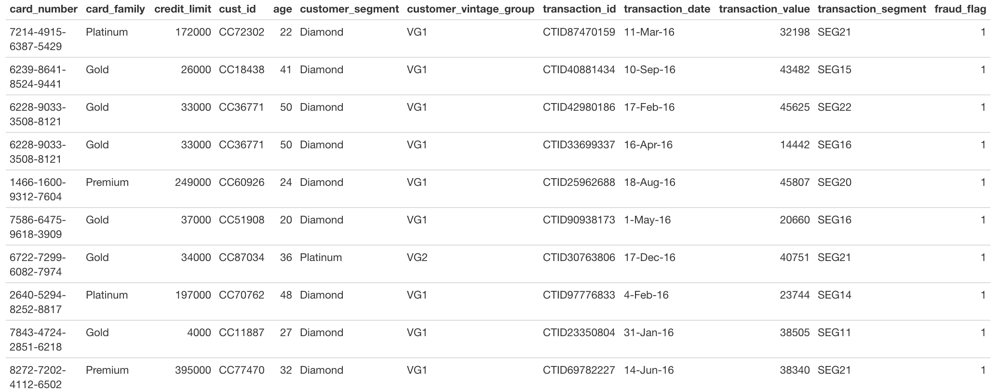

```{r setup, include=FALSE}
knitr::opts_chunk$set(echo = TRUE)
```

<br>

The data for the joining tasks is from [Kaggle](https://www.kaggle.com/ananta/credit-card-data) and contains synthetic (fake) credit card information and transactions. The data for the `tidyr` tasks is also synthetic.

```{r}
library(tidyverse)
library(janitor)
```


# MVP

## Joins

<br>
**Question 1**

Read in all 4 credit card transaction datasets and clean column names.

```{r}
# read in data

card_base <- read_csv("data/CardBase.csv")
customer_base <- read_csv("data/CustomerBase.csv")
fraud_base <- read_csv("data/FraudBase.csv")
transactions_base <-read_csv("data/TransactionBase.csv")

card_base <- clean_names(card_base)
customer_base <- clean_names(customer_base)
fraud_base <- clean_names(fraud_base)
transactions_base <- clean_names(transactions_base)


```


**Question 2**

Join the data containing card details and customer details by customer id, so that all records of card details and any matching records in customer details are kept. Before you run the code, think about how many rows you expect to see after joining.

```{r}
card_base
customer_base

left_join(card_base, customer_base, by = c("cust_id" = "cust_id"))
```


**Question 3**

Join the data containing fraud details with transaction details so all rows of both tables are kept. What does the resulting row number tell you?


```{r}
fraud_base
transactions_base


full_join(fraud_base, transactions_base, by = c("transaction_id" = "transaction_id"))

# it tells me that there were no fraud alerts on transaction ids not contained with in the transaction table
```


**Question 4**

Join the data containing card details with transaction details so rows from the first which have matching ones in the second are returned, but only return rows in the first table once.

```{r}
card_base
transactions_base

semi_join(card_base, transactions_base, by = c("card_number" = "credit_card_id"))


```


## `tidyr`

**Question 5**

Read in `hat_observations` and separate `observation` into two columns, `hat_colour` and `hat_type`.

```{r}
hats <- read_csv("data/hat_observations.csv") %>% 
   separate(observation, 
           into = c("hat_colour", "hat_type"), 
           sep = ",", extra = "merge")

hats
```


**Question 6**

Unite `day`, `month`, and `year` columns into a column called `date` using a suitable separator. Then find the date where the most berets were observed.

```{r}
hats <- hats %>% 
  unite(col = "date", c("day", "month", "year"), sep = "-")

hats %>% 
  group_by(date) %>% 
  filter(hat_type == "beret") %>%
  summarise(total = sum(observation_count)) %>% 
  slice_max(total)
```


# Extension

## Joins

**Question 1**

Can you join all 4 datasets together so that you're left with a dataset that looks like below with **109 rows** and **12 columns**?




```{r}
card_base #card_number, #cust_id
customer_base #cust_id
fraud_base #transaction_id
transactions_base # transaction_id, credit_card_id


full_join(customer_base, card_base, by = c("cust_id" = "cust_id" )) %>% 
full_join(transactions_base, by = c("card_number" = "credit_card_id")) %>% 
right_join(fraud_base, by = c("transaction_id" = "transaction_id")) 


```


## `tidyr`

**Question 2**

Read in `exam_scores` and transform it into long format with two new columns `exam_question` and `score`. Then, using `separate` and `select`, remove superfluous information from the values in `exam_question`


```{r}
read_csv("data/exam_scores.csv") %>% 
    pivot_longer(cols = starts_with("exam"), 
               names_to = "exam_question",
               values_to = "score",
               names_prefix = "exam_Q",
               names_transform = as.numeric)

read_csv("data/exam_scores.csv") %>% 
    pivot_longer(cols = starts_with("exam"), 
               names_to = "exam_question",
               values_to = "score") %>% 
    separate(exam_question, 
           into = c("blah", "exam_question"), 
           sep = "Q", extra = "merge") %>% 
    mutate(exam_question = as.numeric(exam_question)) %>% 
    select(id, exam_question, score)

```

